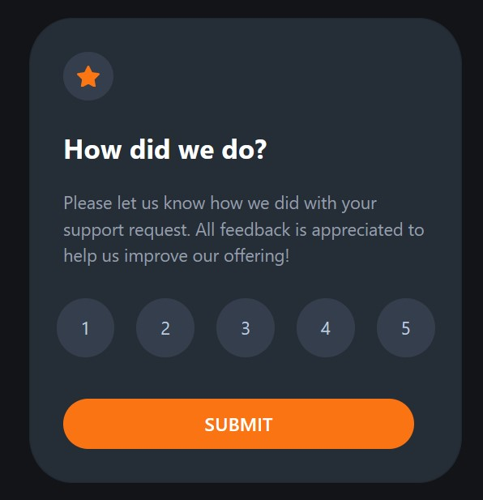

# Frontend Mentor - Interactive rating component solution

This is a solution to the [Interactive rating component challenge on Frontend Mentor](https://www.frontendmentor.io/challenges/interactive-rating-component-koxpeBUmI).

## Table of contents

- [Overview](#overview)
  - [The challenge](#the-challenge)
  - [Screenshot](#screenshot)
  - [Links](#links)
- [My process](#my-process)
  - [Built with](#built-with)
  - [What I learned](#what-i-learned)

## Overview

### The challenge

Users should be able to:

- View the optimal layout for the app depending on their device's screen size
- See hover states for all interactive elements on the page
- Select and submit a number rating
- See the "Thank you" card state after submitting a rating

### Screenshot

### Links

- Solution URL: [GitHub](https://github.com/manonthemon/Interactive-rating-component)
- Live Site URL: [GitHub Pages](https://manonthemon.github.io/Interactive-rating-component/)

## My process

### Built with

- HTML
- CSS custom properties
- Flexbox
- JavaScript
-jQuery

### What I learned

Completing this project helped my practice basic HTML, CSS and JS skills, including DOM manipulation.
